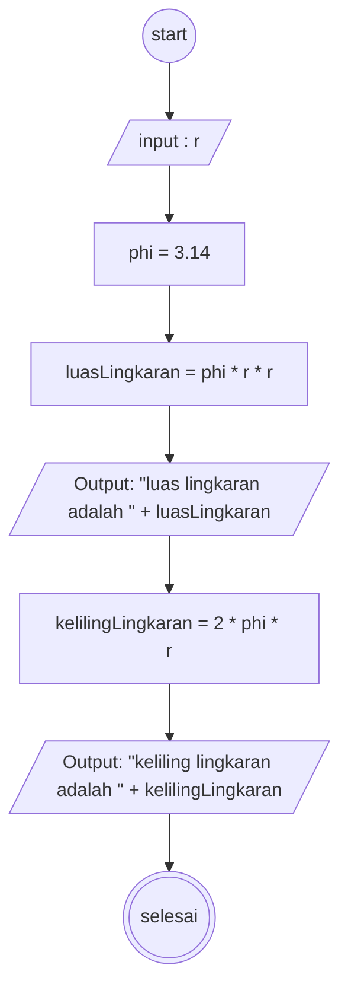

# Algoritma Javascript 1

## Task 1

## Flowchart

```mermaid
flowchart TD

  A@{shape: circle, label: "start"}
  B@{shape: lean-r, label: "input : r"}
  C@{shape: rect, label: "phi = 3.14"}
  D@{shape: rect, label: "luasLingkaran =  phi * r * r"}
  E@{shape: lean-r, label: 'Output: "luas lingkaran adalah " + luasLingkaran'}
  F@{shape: rect, label: "kelilingLingkaran = 2 * phi * r"}
  G@{shape: lean-r, label: 'Output: "keliling lingkaran adalah " + kelilingLingkaran'}
 H@{shape: dbl-circ, label: "selesai"}

  A --> B
  B --> C
  C --> D
  D --> E
  E --> F
  F --> G
  G --> H
```
