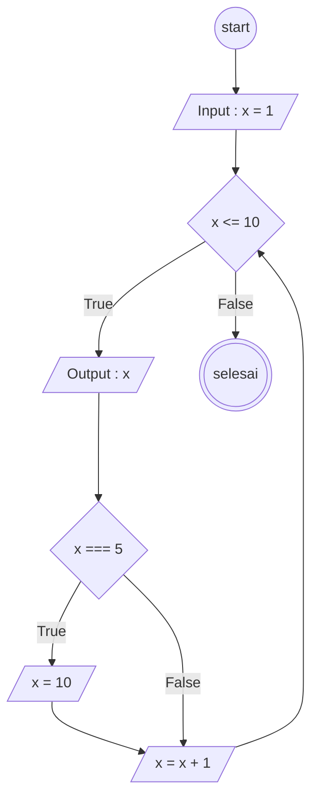
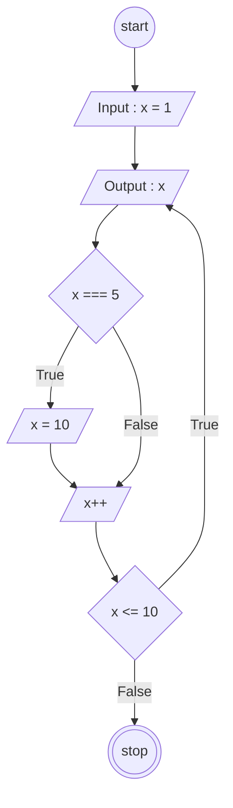

# Perulangan

## Flowchart Loop

```javascript
for (let x = 1; x <= 10; x++) {
  console.log(x);
  if (x === 5) {
    x = 10;
  }
}
```



## Flowchat do while loop

```javascript
let x = 1;

do {
  console.log(x);

  if (x === 5) {
    x = 10;
  }

  x++;
} while (x <= 10);
```


