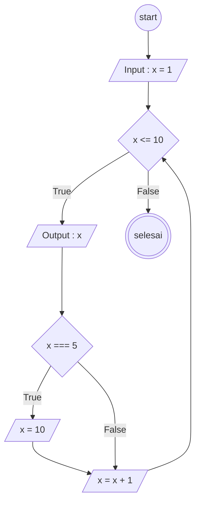

# Perulangan

## Flowchart Loop

```mermaid
flowchart TB
  start@{shape: circle}
  inisialState@{shape: lean-r, label : 'Input : x = 1'}
  condition@{shape: diamond, label : 'x <= 10'}
  log@{shape: lean-r, label : 'Output : x'}
  contitionIf@{shape: diamond, label: 'x === 5'}
  x10@{shape: lean-r, label: 'x = 10'}
  update@{shape: lean-r, label: 'x = x + 1'}


  selesai@{shape: dbl-circ, label, 'selesai'}

  start --> inisialState
  inisialState --> condition
  condition --True--> log
  condition --False-->selesai
  log ---> contitionIf
  contitionIf --True--> x10 --> update
  update --> condition
  contitionIf --False-->update
```
