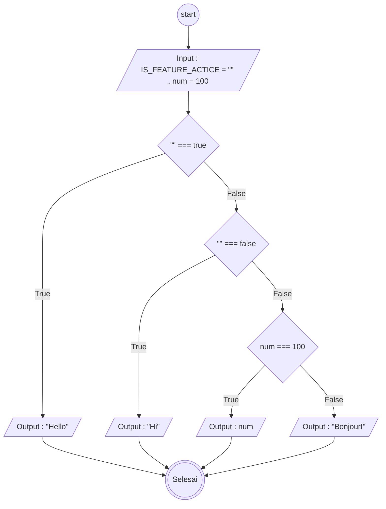

# Flowchart switch

## flowchart

```mermaid
flowchart
  start@{shape: circle}
  input@{shape: lean-r, label: 'Input : IS_FEATURE_ACTICE = "" , num = 100'}
  true@{shape: diamond, label: '"" === true'}
  outputTrue@{shape: lean-r, label : 'Output : "Hello"'}
  false@{shape: diamond, label: '"" === false'}
  outputFalse@{shape: lean-r, label : 'Output : "Hi"'}
  default@{shape: diamond, label: 'num === 100'}
  defaultTrue@{shape: lean-r, label : 'Output : num'}
  defaultFalse@{shape: lean-r, label : 'Output : "Bonjour!"'}

  selesai@{shape: dbl-circ, label: "Selesai"}

  start --> input
  input --> true
  true --True --> outputTrue -->  selesai
  true --False --> false
  false --True-->  outputFalse  -->  selesai
  false --False--> default
  default --True--> defaultTrue -->  selesai
  default --False--> defaultFalse -->  selesai


```
