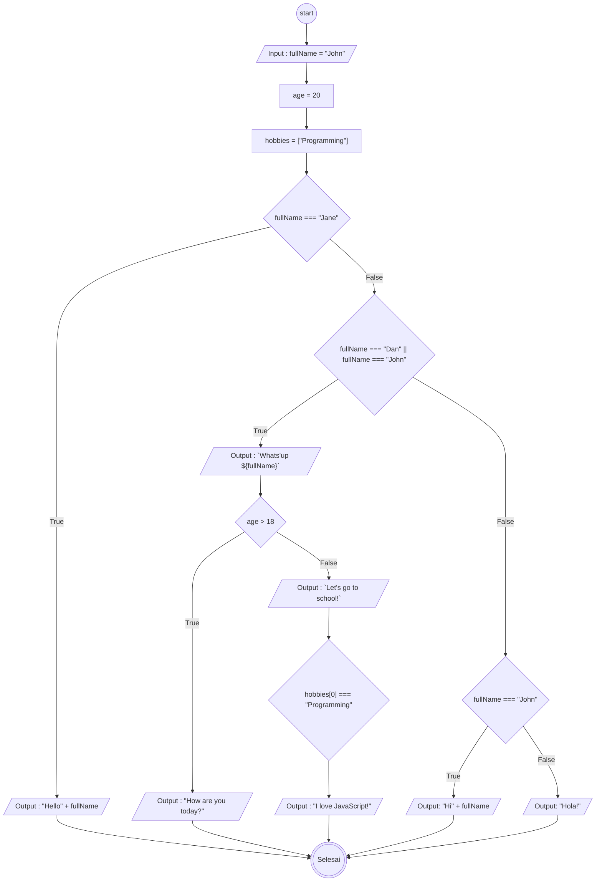

# Algoritma

## flowchart

```mermaid
flowchart TD
  A@{shape: circle, label: "start"}
  B@{shape: lean-r, label: 'Input : fullName = "John"'}
  C@{shape: rect, label: 'age = 20'}
  D@{shape: rect, label: 'hobbies = ["Programming"]'}
  E@{shape: diamond, label : 'fullName === "Jane"'}
  F@{shape: lean-r, label : 'Output : "Hello" + fullName'}
  G@{shape: diamond, label: 'fullName === "Dan" || fullName === "John"'}
  H@{shape: lean-r, label: "Output : `Whats'up ${fullName}`"}
  I@{shape: diamond, label: 'age > 18'}
  J@{shape: lean-r, label: 'Output : "How are you today?"'}
  K@{shape: lean-r, label: "Output : `Let's go to school!`"}
  L@{shape: diamond, label: 'hobbies[0] === "Programming"'}
  M@{shape: lean-r, label: 'Output : "I love JavaScript!"'}
  N@{shape: diamond, label: 'fullName === "John"'}
  O@{shape: lean-r, label: 'Output: "Hi" + fullName'}
  P@{shape: lean-r, label: 'Output: "Hola!"'}
  Q@{shape: dbl-circ, label: "Selesai"}


  A --> B
  B --> C
  C --> D
  D --> E
  E --True--> F --> Q
  E --False--> G
  G --True--> H
  H --> I
  I --True--> J --> Q
  I --False--> K
  K --> L
  L --> M --> Q
  G --False--> N
  N --True--> O --> Q
  N --False--> P --> Q

```
