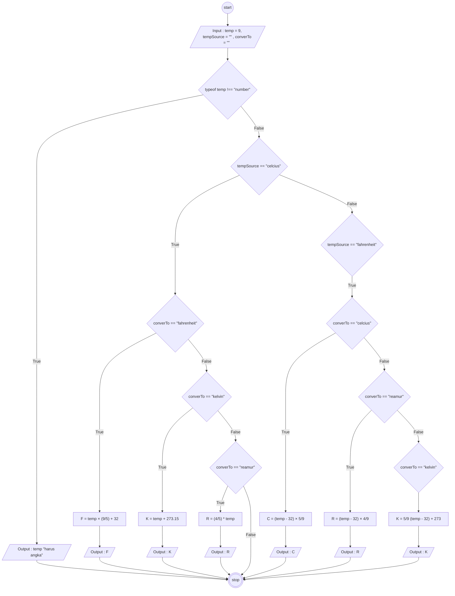

# Membuat Flowchart Konversi Suhu

## flowchart

```mermaid
flowchart
  start@{shape: circle }
  input@{shape: lean-r, label : 'Input : temp = 9, tempSource = "" , converTo = ""  '}
  isNumber@{shape: diamond, label: 'typeof temp !== "number"'}

  harusAngka@{shape: lean-r, label : 'Output : temp "harus angka"'}
  isCelcius@{shape: diamond, label : 'tempSource == "celcius"'}
  targetFahrenheit@{shape : diamond, label : 'converTo == "fahrenheit"'}

  processF@{shape: rect, label : 'F = temp × (9/5) + 32'}
  outputF@{shape: lean-r, label : 'Output : F'}

  stop@{shape : dbl-circ}

  isFahrenheit@{shape: diamond, label : 'tempSource == "fahrenheit"'}
  targetCelcius@{shape : diamond, label : 'converTo == "celcius"'}
  processC@{shape: rect, label : 'C = (temp - 32) × 5/9'}
  outputC@{shape: lean-r, label : 'Output : C'}

  cToK@{shape: diamond, label : 'converTo == "kelvin"'}
  proccesCtoK@{shape : rect, label : 'K = temp + 273.15'}
  outputCtoK@{shape: lean-r, label : 'Output : K'}

  cToR@{shape: diamond, label : 'converTo == "reamur"'}
  proccesCtoR@{shape : rect, label : 'R = (4/5) * temp'}
  outputCtoR@{shape: lean-r, label : 'Output : R'}

  fToR@{shape: diamond, label : 'converTo == "reamur"'}
  proccesFtoR@{shape : rect, label : 'R = (temp - 32) × 4/9'}
  outputFtoR@{shape: lean-r, label : 'Output : R'}

  fToK@{shape: diamond, label : 'converTo == "kelvin"'}
  proccesFtoK@{shape : rect, label : 'K = 5/9 (temp - 32) + 273'}
  outputFtoK@{shape: lean-r, label : 'Output : K'}


  start --> input
  input --> isNumber
  isNumber --True--> harusAngka --> stop
  isNumber --False--> isCelcius
  isCelcius --True--> targetFahrenheit
  targetFahrenheit --True--> processF
  processF --> outputF --> stop

  isCelcius --False --> isFahrenheit
  isFahrenheit --True--> targetCelcius
 targetCelcius --True--> processC
 processC --> outputC --> stop

targetFahrenheit --False--> cToK
cToK --True-->proccesCtoK-->outputCtoK
outputCtoK --> stop

cToK --False-->cToR
cToR --True--> proccesCtoR
proccesCtoR --> outputCtoR --> stop
cToR --False--> stop

targetCelcius --False--> fToR
fToR --True--> proccesFtoR
proccesFtoR --> outputFtoR --> stop

fToR --False--> fToK
fToK --> proccesFtoK
proccesFtoK --> outputFtoK --> stop
```
